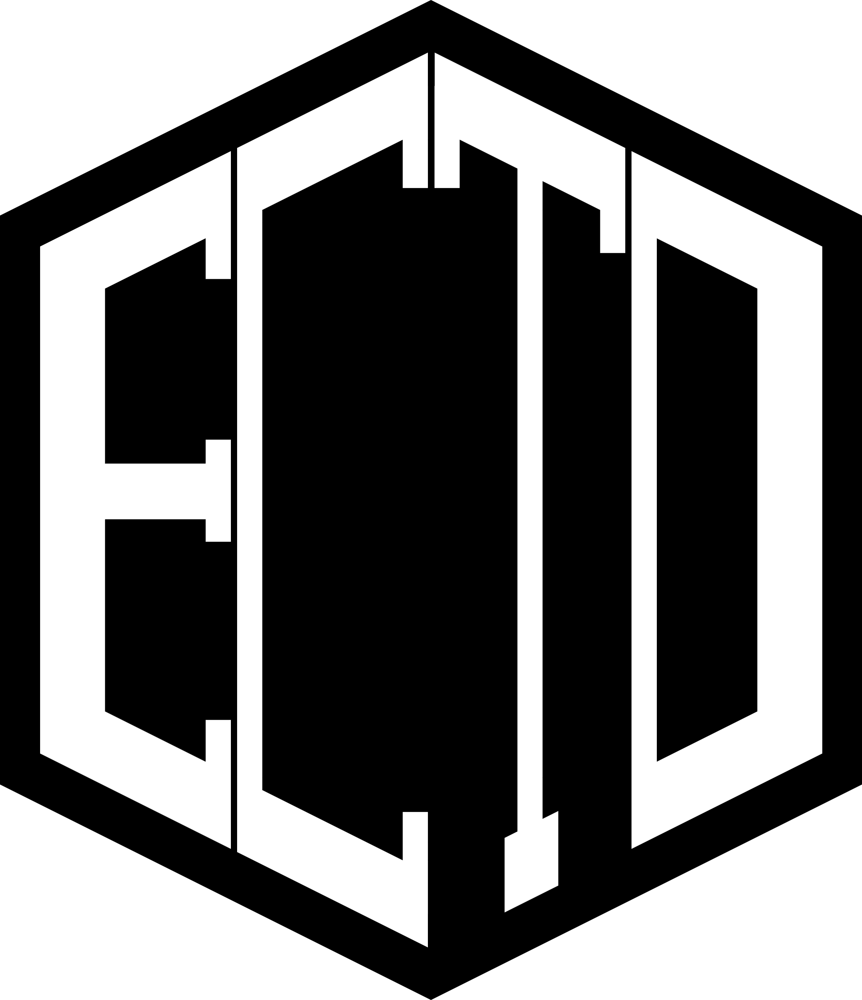
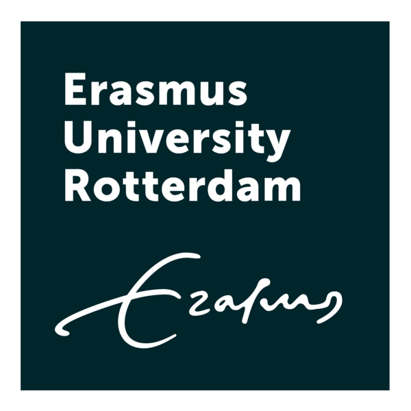

# Expert Consensus on an Open-Textbook for Theory Development Methodology

  

ECTO is a Delphi-style expert consensus project that develops the scope, structure, content priorities, and quality criteria for an open textbook and curriculum on theory development methodology in psychological science.

This repository is the public transparency layer for the project. It documents protocols, public survey materials, decision records, logbook entries, and anonymized or aggregated outputs approved for public release. The full textbook itself will be developed later from the consensus process.

## Quick links

- Website: <https://nnnvd.github.io/ECTO/>
- Project description: <https://nnnvd.github.io/ECTO/project-description/>
- Expert identification protocol: <https://nnnvd.github.io/ECTO/expert-identification/>
- Search strategy: <https://nnnvd.github.io/ECTO/search-strategy/>
- Logbook: <https://nnnvd.github.io/ECTO/logbook/>
- Zenodo concept DOI: <https://doi.org/10.5281/zenodo.18760330>

## Public materials

Public phase materials are stored in versioned folders. Sensitive expert data, consent forms, raw survey exports, and identifiable responses are not stored in this repository.

- Phase 1 v0.0: Tasks and responsibilities of a theorist
  - [PDF](v0.0/phase_1/Phase%201_%20Tasks%20and%20Responsibilities%20of%20a%20Theorist%20v0.0.pdf)
  - [Markdown source](v0.0/phase_1/p1_v0.0.md)

## What this repository is for

- Delphi project documentation and decision records.
- Public instruments and approved project materials.
- Public logbook entries and revision histories.
- Citable GitHub/Zenodo releases of public project outputs.

## What this repository is not for

- Raw Delphi responses or identifiable expert data.
- Signed consent forms or private correspondence.
- Copyright-restricted PDFs or other materials without distribution rights.
- The final textbook manuscript, until the consensus process supports that stage.

## License

Unless stated otherwise, documentation and other text materials are licensed under CC BY 4.0. Code, scripts, and automation are licensed under the MIT License. See [LICENSE-CONTENT](LICENSE-CONTENT) and [LICENSE-CODE](LICENSE-CODE).

## Funding and affiliation

<table>
  <tr>
    <td style="vertical-align: top; padding-right: 16px;">
      
    </td>
    <td style="vertical-align: top; padding-right: 16px;">
      
    </td>
    <td style="vertical-align: top;">
      This project is part of <em>The next step in methodological innovation: Open and collaborative theory development</em>, file number <strong>VI.Veni.231G.093</strong>, funded by the Dutch Research Council (NWO), and is affiliated with Erasmus University Rotterdam.
    </td>
  </tr>
</table>
